

  

<h1 align="center">🌲 水杉中文</h1>

<h1 align="center">Shuishan ChineseEdu</h1>

  <strong>赋能未来中文教育：更智能、更沉浸、更高效</strong>
   
  <strong>Empowering the Future of Chinese Education: Smarter, More Immersive, More Effective</strong>

  
  
  

  <strong>选择语言 (Select Language):</strong>
   
  <a href="#zh-cn"><strong>简体中文</strong></a> | <a href="#en-us"><strong>English</strong></a>

---

### 🚀 关于我们

欢迎来到水杉国际中文教育 (Shuishan-ChineseEdu) 项目！我们是隶属于 **DASE-CogAI** 的一个专注团队，致力于融合前沿的人工智能技术（如自然语言处理、知识图谱、学习者建模）与创新的教学法，为全球中文学习者和教师打造一个智能、高效、且富有文化沉浸感的教与学生态系统。

我们的使命是打破语言学习的壁AR，让中文学习变得前所未有的轻松、有趣和个性化。

### ✨ 核心理念

* **🤖 AI驱动 (AI-Powered):** 利用AI实现自适应学习路径、智能纠音、AI助教和个性化内容推荐。
* **🏞️ 场景沉浸 (Immersive Scenarios):** 强调“用中学”，提供基于真实生活、学术和职业场景的互动式学习。
* **🌐 生态互联 (Connected Ecosystem):** 打通“学-练-测-评-教”所有环节，为学习者、教师和机构提供一体化解决方案。

### 🔗 Links

- 🌐 Official Website / GitHub Repo: [https://github.com/DASE-CogAI/Shuishan-ChineseEdu](https://github.com/DASE-CogAI/Shuishan-ChineseEdu)

---

## 🌏 产品简介

### 💡 背景与愿景 

在全球“中文热”持续升温的背景下，在线学习为国际中文教育带来了前所未有的机遇。当代学习者愈发青睐“做中学”的模式，期待通过碎片化、高频率的练习来提升语言运用能力。   

### 🧩 教育挑战 

然而，如何让零散、片段化的学习活动构建起系统性、完整的知识体系，成为当代在线教育平台的核心挑战。  

### 🤝 跨界合作与平台诞生 

直面这一痛点，华东师范大学数据科学与工程学院与国际汉语文化学院跨界合作，倾力打造了 **“水杉中文（Shuishan ChineseEdu）”** 平台。  

平台以 **前沿人工智能技术（AI）** 为内核，致力于打造一个 **以学习者为中心、实现高效认知建构** 的国际中文智慧学习系统，推动国际中文教育迈向 **智能化、个性化与高效化** 的新阶段。  

### 🎯 核心使命 

“水杉中文”的核心使命在于破解“碎片化学习”与“系统性构建”之间的深层矛盾，致力于让每一次零散的碎片化学习都成为构建坚实语言大厦的基石。  

### 🧠 创新学习模式 

平台以“系统性知识建构”为目标，探索多样化的碎片化学习新模式：  

- 🏞️ **场景沙盒 / Scenario Sandbox**：在真实语境中进行语言体验与任务式学习  

- 🎯 **主题闯关 / Thematic Challenges**：通过分级任务逐步掌握语言知识与文化内容  

- 🤖 **智能推送 / Intelligent Recommendation**：基于学习行为数据动态推送个性化学习资源 

### 🔍 技术核心 

一方面，依托 **AIGC 技术** 与 **大规模国际中文教育知识图谱**，平台能够动态生成多模态中文学习资源； 

另一方面，为解决“学需”和“供给”不匹配的问题，平台打造了 **自适应学习引擎**，汇聚全域学习行为数据，实现 **细粒度学习者画像** 与 **动态学情评估**；  

最终为每位中文学习者动态推送最适配的学习资源与路径， 确保内容的相关性与体系性，真正提升碎片化学习的实效与深度。 

  
    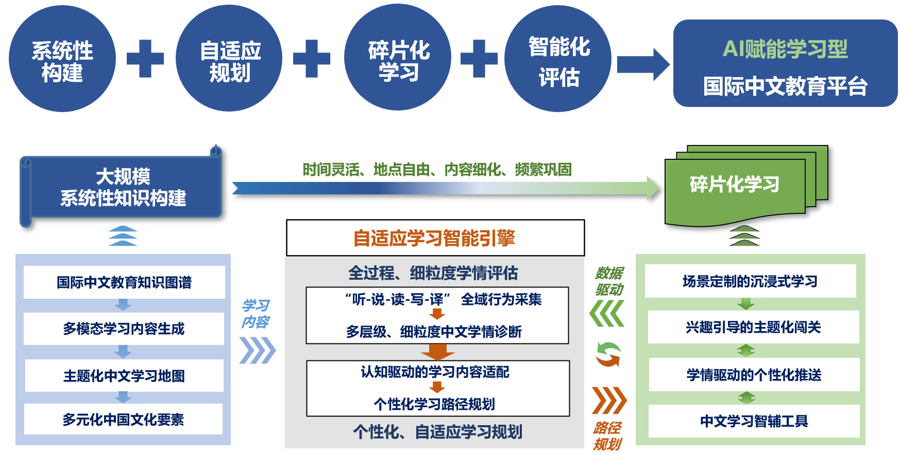
  

<b>图1. 水杉中文 - 核心特色</b>

---

## 🧩 产品内容 

### 📱 (一) APP端：学习服务

  
    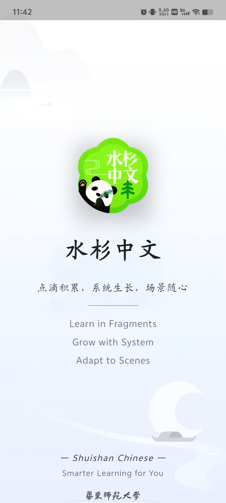
  
  
    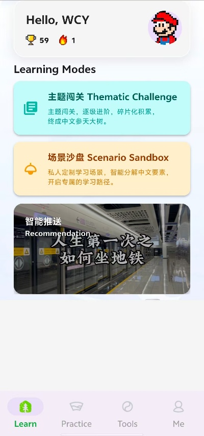
  

<b>图2. 水杉中文 - 封面与首页</b>

#### 🏞️ 场景沙盒：定制你的沉浸式中文世界  

告别千篇一律的课本对话，**“水杉中文”** 通过「场景沙盒」为您构建高度定制、可自由探索的中文应用场景。  
无论是模拟在咖啡馆点单、街边问路，还是在市场讨价还价，您都可以在定制化语境中进行 **“Vibe Language Learning”**。  

学习引擎会根据您自定义的场景，动态生成合理的学习路径，并结合学习兴趣与语言水平，自适应调整学习难度。  
让您不仅“学中文”，更能“用中文”去体验与思考，实现从知识积累到能力养成的关键跃迁。

  
    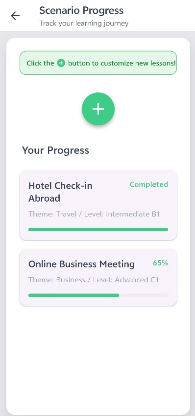
  
  
    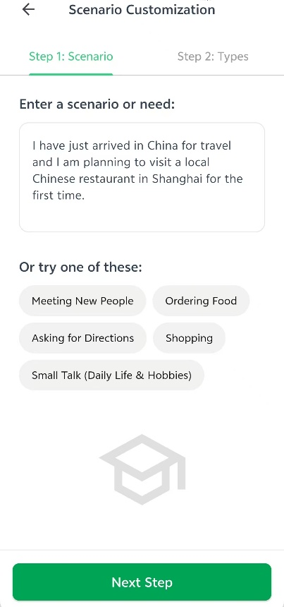
    
    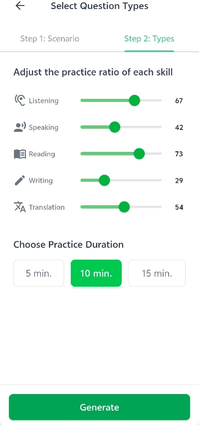
  

<b>图3. 场景沙盒-场景定制</b>

  
    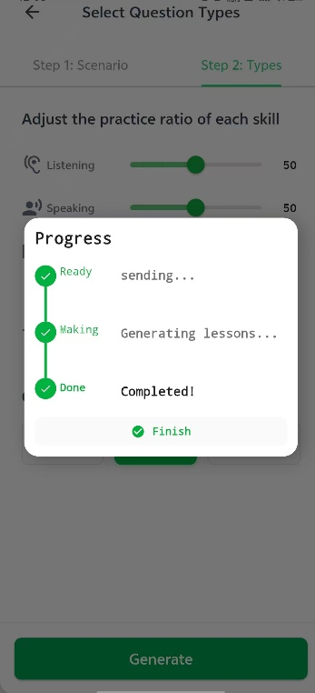
  
  
    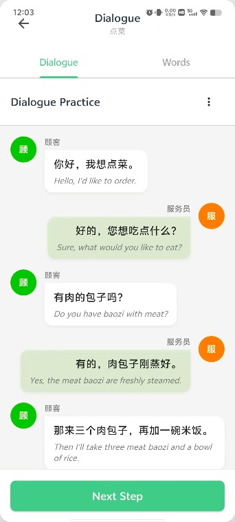
    
    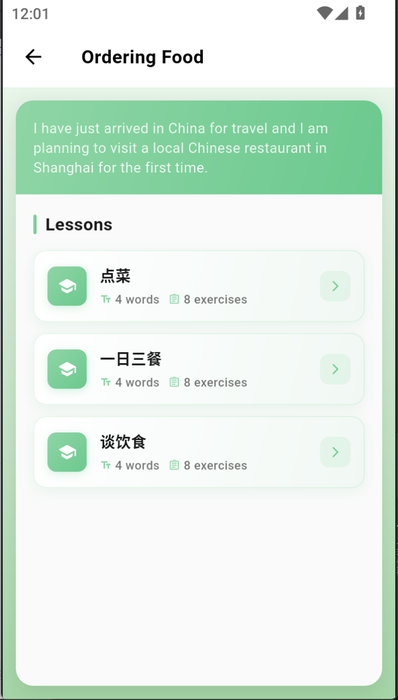
  

<b>图4. 场景沙盒-学习路径动态生成</b>

#### 🎯 主题闯关：在兴趣牵引下高效进阶  

**“水杉中文”** 以引人入胜的主题闯关模式，重塑游戏化、激励性的中文学习路径。  
您将跟随精心设计的剧情线，逐级解锁与 **生活、旅行、文化、科技** 等热门领域相关的内容关卡。  

多模态内容生成技术会持续为您创造新鲜的学习素材，而 **自适应学习引擎** 则像一位贴身教练：  

- 📈 根据学习目标（时长、技能偏好等）动态适配内容；  
- 💬 在遇到瓶颈时提供精准提示；  
- 🚀 学有余力时智能推荐更具挑战性的主题。  

让整个学习旅程始终保持 **趣味性、高效性、无冗余**。

  
    
  
  
    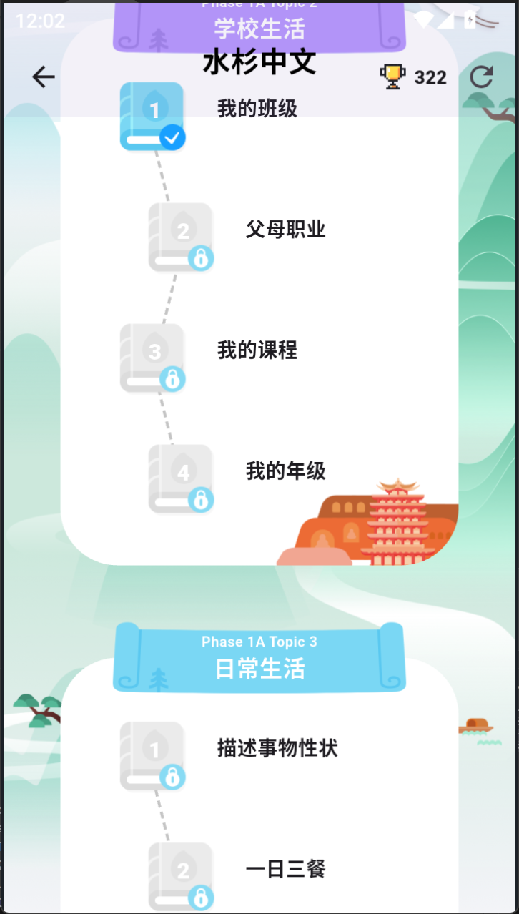
    
    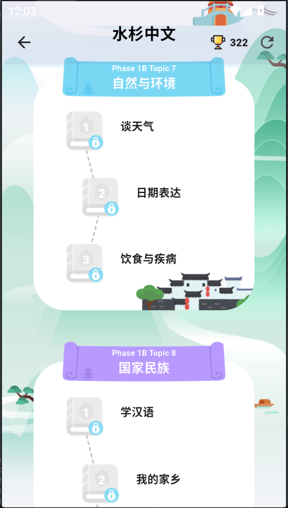
  

<b>图5. 主题闯关-逐级主题化中文学习路径</b>

  
    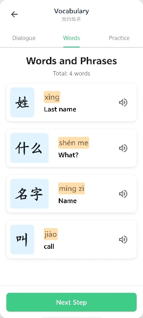
  
  
    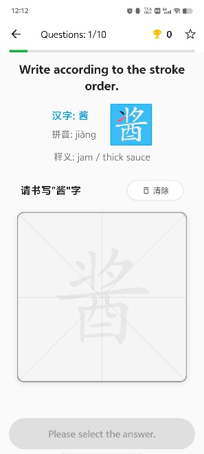
    
    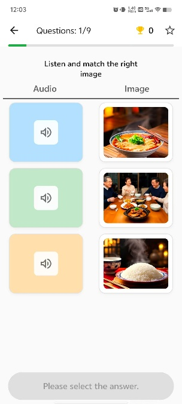
  
     
    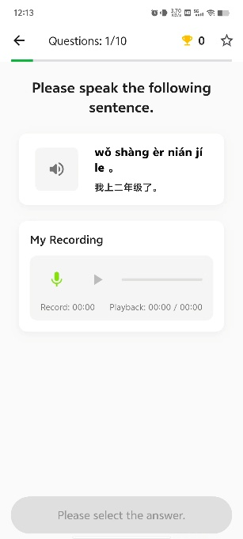
  

<b>图6. 主题闯关-碎片化词汇练习、多技能习题练习 </b>

    
#### 🧰 智辅工具：即插即用的语言学习利器  

**“水杉中文”** 持续推出一系列 **智辅工具集（Smart Toolkit）**， 将复杂的 AI 能力封装为轻量、易用的模块，让最前沿的语言教育科技触手可及。  

您可以像使用瑞士军刀一样，按需调用各类功能，精准解决学习痛点。目前已开放的工具包括：

- 🧠 **知识图谱**：以自然语言查询任意词语或文化点的网络化知识关联，如同拥有一个“可视化中文大脑”，帮助您系统理解知识体系。  

- ✏️ **文本改写**：输入任意等级的句子，一键完成分词、分析与难度改写，让同一文本自动适配不同水平的学习者。  

- 📝 **作文批改**：支持手写作文图片输入，从书写规范、用词精准到逻辑连贯性多维评估，并在原图上可视化反馈修改建议。  

  
    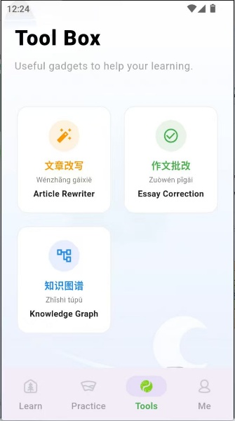
  
  
    
    
    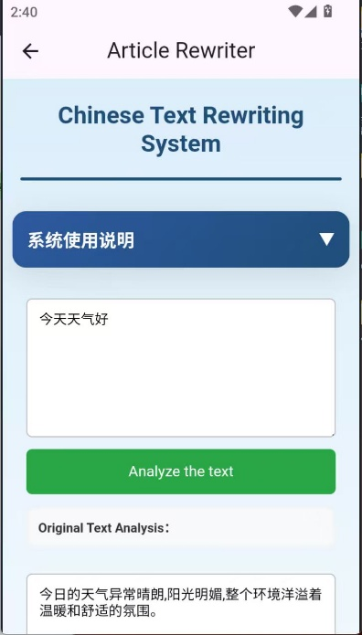
  

<b>图7. 智辅工具-文本改写、作文批改 </b>

#### ⚙️ 自适应学习引擎：数据驱动的专属学习管家  

作为 **“水杉中文”** 的智慧核心，自适应学习引擎通过 **全域数据追踪、学情评估与个性化推荐**， 为每位用户构建专属的 **自适应学习闭环**。

##### 📊 全域行为数据追踪  

平台持续采集您在「学、练、用」各环节的行为数据，进行融合分析与特征建模，形成完整的学习历程画像，为后续学习决策注入精准动力。

##### 🧩 多粒度学情评估  

依托大规模知识图谱，实现从 **字词掌握 → 主题知识 → 综合能力** 的多层次评估， 并通过可视化看板呈现，让学习者与系统都能精准定位薄弱环节。

  
    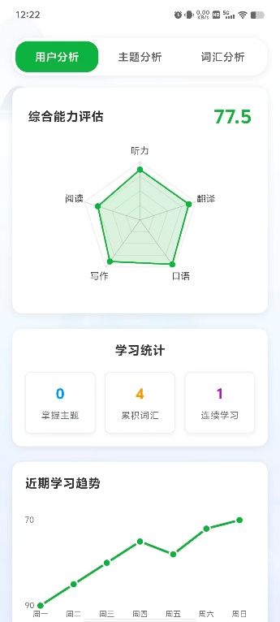
  
  
    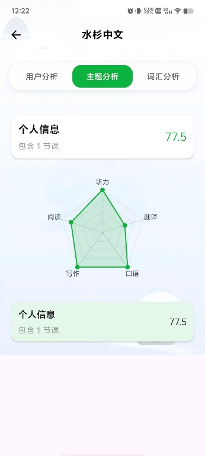
    
    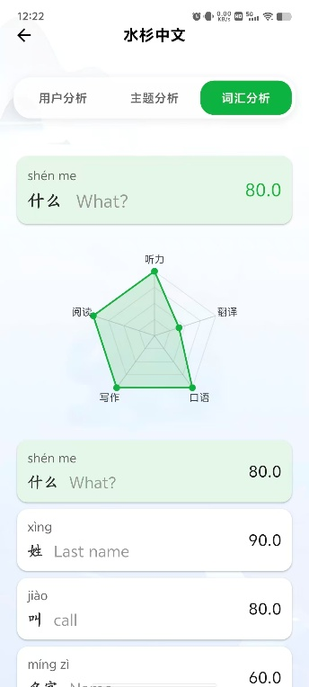
  

<b>图8. 学习引擎-多粒度学情评估</b>

    
##### 💡 个性化学习推荐  

基于动态学情与兴趣偏好，引擎会动态重构引擎会实时调整您的学习内容与路径

- 推荐主题闯关任务  
- 生成专项练习集  
- 引导进入场景沙盒巩固学习  

确保每个学习内容都精准匹配您的学习状态与目标，实现 **高效、智能、无冗余的学习体验**。

  
    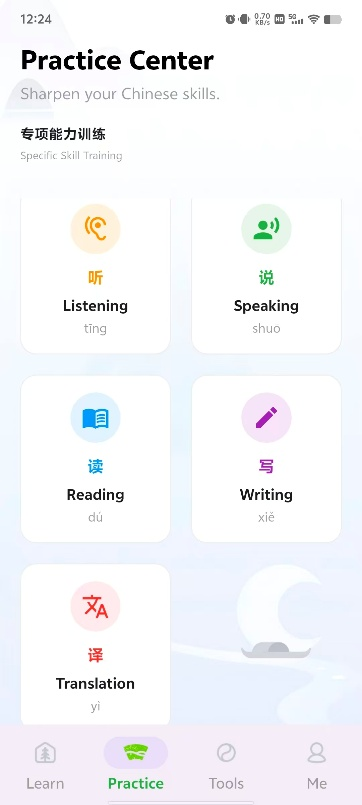
  
  
    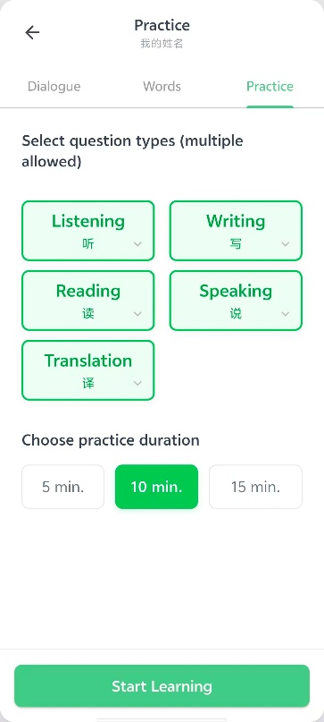
    
    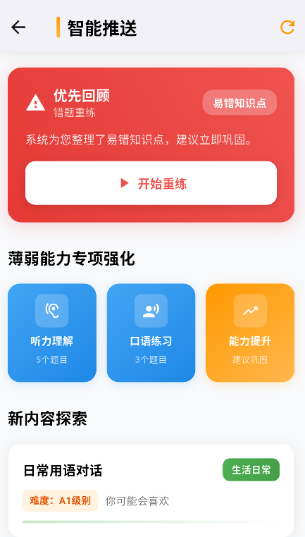
  

<b>图9. 学习引擎-全平台个性化推荐服务</b>

### 💻 (二) 网页端：教学服务、管理服务
#### 📚 一站式教学管理

水杉中文还提供了兼顾 **“教、学、练、测、管”** 全链路的一站式中文教学平台。  
五个环节环环相扣，覆盖了教与学的全场景。

对于中文教师，平台支持以下功能：  
- 🧾 **课程管理与班级管理**：支持灵活的课程与班级组织方式。  
- 🧠 **教学辅助服务**：包括备课、授课场景下的习题生成、测验组卷、作业批改等功能。  
- 🤖 **AI赋能工具库**：平台还提供全面的AI工具支持，使“教”与“管”更加高效，帮助教师释放创造力。  

  
    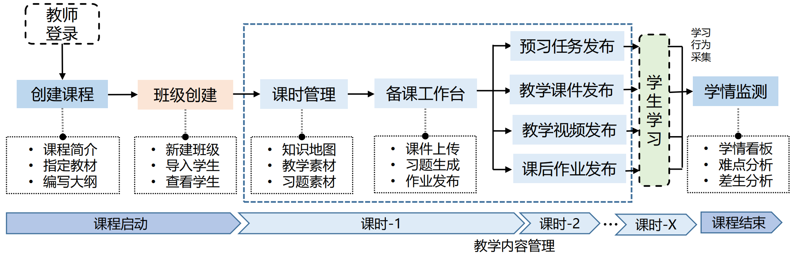
  

<b>图10. 一站式教学管理服务</b>

 

  
    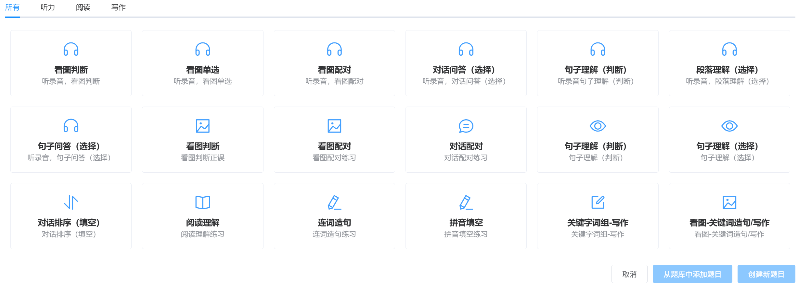
  

<b>图11. 教师备课-习题生成、测验组卷服务</b>

## 🖥️ 封面页

  
    
  
  
<b>📱 APP端</b>

      
    
     

<b>💻 网页端</b>

## 🎬 产品视频

## 🌿 项目

  
    

  
  

# 英文版本

### 🚀 About Us

Welcome to the **Shuishan ChineseEdu** initiative — a project under **DASE-CogAI**, dedicated to integrating cutting-edge **artificial intelligence technologies** (such as **Natural Language Processing**, **Knowledge Graphs**, and **Learner Modeling**) with innovative pedagogical methods.
 Our goal is to create an **intelligent, efficient, and culturally immersive learning ecosystem** for Chinese learners and educators worldwide.

Our mission is to **break the barriers of language learning**, making Chinese acquisition easier, more engaging, and deeply personalized than ever before.

### ✨Core Philosophy

* **🤖 AI-Powered:**
   Leverage AI to enable adaptive learning paths, intelligent pronunciation correction, AI tutoring, and personalized content recommendations.
* **🏞️ Immersive Scenarios:**
   Emphasize *learning by using*, offering interactive learning experiences grounded in real-life, academic, and professional contexts.
* **🌐 Connected Ecosystem:**
   Integrate all stages of learning — *study, practice, assessment, evaluation, and instruction* — to deliver a unified, data-driven solution for learners, teachers, and institutions alike.

### 🔗 Links

- 🌐 Official Website / GitHub Repo: [https://github.com/DASE-CogAI/Shuishan-ChineseEdu](https://github.com/DASE-CogAI/Shuishan-ChineseEdu)

---
## 🌏 Product Introduction

### 💡  Background & Vision

Amid the global surge of enthusiasm for learning Chinese, online education has created unprecedented opportunities for international Chinese language learning. Modern learners increasingly favor a “learning by doing” approach, seeking fragmented yet frequent exercises to enhance language proficiency.

### 🧩  Educational Challenge

However, how to transform scattered and piecemeal learning activities into a systematic and coherent learner cognitive structure has become a core challenge for modern online education platforms.

### 🤝Cross-disciplinary Collaboration

To address this challenge, the **School of Data Science and Engineering** and the **School of International Chinese Studies** at **East China Normal University** have jointly developed the **“Shuishan ChineseEdu”** platform.

Powered by cutting-edge **AI technologies**, the platform aims to build a **learner-centered, cognitively efficient intelligent system** for international Chinese education, leading the field toward **intelligent, personalized, and efficient learning**.

### 🎯  Core Mission

The core mission of **Shuishan ChineseEdu** is to resolve the tension between **fragmented learning** and **systematic knowledge construction**,  ensuring that every micro-learning activity becomes a solid building block for language mastery.

### 🧠 Innovative Learning Paradigms

 The platform explores new micro-learning paradigms aimed at **systematic knowledge construction**, including:

- 🏞️ **Scenario Sandbox**：Engage in contextualized and task-based learning through immersive scenes.

- 🎯 **Thematic Challenges**：Master linguistic and cultural knowledge through progressive thematic challenges.

- 🤖 **Intelligent Recommendation**：Dynamically recommend personalized content based on learning behavior data.

### 🔍 Technological Core

On one hand, leveraging **AIGC technology** and a **large-scale knowledge graph** of international Chinese education,  the platform can dynamically generate **multimodal Chinese learning materials**.

On the other hand, to address the mismatch between **learning needs** and **content supply**,  the platform integrates an **adaptive learning engine** that aggregates global learning data to build **fine-grained learner profiles** and **real-time learning assessments**.q

This enables **personalized, adaptive learning paths** for each learner, ensuring relevance, structure, and true learning efficiency.

  
    
  

<b>Figure 1. Shuishan ChineseEdu – Core Features</b>

---

## 🧩 Product Content 
### 📱 (一) APP端：学习服务 (Mobile App: Learning Services)  

  
    
  
  
    
  

<b>Figure 2. Shuishan ChineseEdu - Cover and Homepage</b>

#### 🏞️ **Scenario Sandbox: Customize Your Immersive Chinese Learning**  

Say goodbye to repetitive textbook dialogues—**Shuishan ChineseEdu** builds a highly customized, freely explorable Chinese language environment through its Scenario Sandbox feature. Whether you’re ordering coffee at a café, asking for directions on the street, or bargaining at a local market, you can engage in **Vibe Language Learning** within authentic, personalized contexts.   

Our learning engine can dynamically generate appropriate learning paths based on your customized scenarios, while adaptively adjusting difficulty levels in line with your interests and language proficiency. In this way, you’re not just learning Chinese—you’re using Chinese to experience, explore, and think, achieving the crucial leap from knowledge accumulation to real communicative competence.

  
    
  
  
    
    
    
  

<b>Figure 3. Scenario Sandbox – Scene Customization</b>

    
#### 🎯 **Thematic Challenges: Advancing Efficiently Through Interest-Driven Learning**  

  
    
  
  
    
    
    
  

<b>Figure 4. Scenario Sandbox – Dynamic Learning Path Generation</b>

**Shuishan ChineseEdu** redefines gamified and motivational Chinese learning through its engaging thematic challenge mode, crafting a dynamic and immersive pathway for progress. As you follow a carefully designed storyline, you’ll unlock levels closely connected to popular fields such as **daily life, travel, culture, and technology**.  

More importantly, your learning path is never static. With multimodal content generation, the platform continuously creates fresh learning materials tailored to your evolving needs. Meanwhile, the **adaptive learning engine** acts as your personal coach

- 📈 perceiving your learning status in real time and dynamically adjusting content based on your customized goals, such as study duration and preferred language skills； 
- 💬 When you hit a plateau, the system provides precise hints;   
- 🚀 when you’re ready for more, it intelligently recommends more challenging levels or new topics of interest.   

This ensures your learning journey remains engaging, efficient, and free of redundancy, always guided by your **curiosity and motivation.**

  
    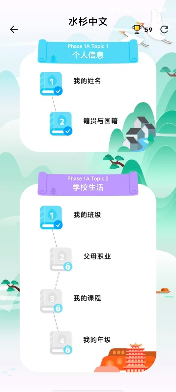
  
  
    
    
    
  

<b>Figure 5. Thematic Missions – Step-by-Step Thematic Chinese Learning Path</b>

  
    
  
  
    
    
    
  
     
    
  

<b>Figure 6. Thematic Missions – Fragmented Vocabulary Practice & Multi-Skill Exercises</b>

    ### 🧰 Intelligent Learning Tools: Plug-and-Play Assistants for Chinese Leaning

**Shuishan ChineseEdu** continuously launches a suite of **intelligent learning tools**, encapsulating complex AI capabilities into lightweight, easy-to-use functional modules. Like a Swiss Army knife for language learning, these tools can be flexibly applied to tackle specific challenges, making cutting-edge language education technology truly accessible.  Currently, the following intelligent tools are available:

- 🧠**Knowledge Graph**：Supports natural language search for any word or cultural concept, revealing web-like knowledge connections. It’s like having a visualized Chinese brain, helping you understand the systematic structure of Chinese knowledge.

- ✏️ **Text Rewritin**： By inputting Chinese sentences of different levels, you can perform one-click word segmentation, text analysis, and difficulty adjustment, automatically adapting the same passage to suit learners of varying proficiency levels.

- 📝 **Essay Evaluation**：Going beyond basic grammar correction, this tool takes handwritten composition images as input and provides multi-dimensional feedback—from handwriting accuracy and word choice precision to logical coherence. It even delivers visual, on-image feedback, offering directly aligned revision suggestions.

  
    
  
  
    
    
    
  

<b>Figure 7. Smart Learning Tools – Text Rewriting & Essay Review</b>

#### ⚙️Adaptive Learning Engine: Your Data-Driven Personal Learning Concierge

The adaptive learning engine is the intelligent core of **Shuishan ChineseEdu**. By integrating **comprehensive behavior tracking**, **multi-granularity learning assessment**, and **personalized learning recommendations**, it constructs a **data-driven adaptive learning ecosystem** designed just for you.

##### 📊**Comprehensive Behavior Tracking**

The platform continuously collects data from all your learning activities—study, practice, and application—and performs integrated analysis across these multi-source datasets. This process generates a coherent portrait of your learning journey, providing the engine with fresh, behavior-driven insights that fuel adaptive optimization.

##### 🧩 **Multi-Granularity Learning Assessment**

Powered by a large-scale knowledge graph, the engine conducts multi-layered diagnostic analysis—from mastery of individual characters and words, to thematic knowledge application, and ultimately to overall language competence. The results are displayed through a visualized dashboard, enabling both you and the system to precisely identify areas of weakness and target them efficiently.

  
    
  
  
    
    
    
  

<b>Figure 8. Learning Engine – Multi-Granularity Learning Assessment</b>

    
##### 💡 **Personalized Learning Recommendations**

Based on your **real-time learning progress** and **interest preferences**, the engine dynamically reconstructs and adjusts your learning content and pathway:

- Whether it’s recommending a set of **thematic challenge exercises**, generating a **targeted practice set**
- or guiding you into the **Scenario Sandbox** for customized contextual reinforcement

the system ensures that every piece of content you encounter precisely aligns with your learning profile and interests, eliminating aimless repetition and redundancy, and enabling truly **efficient, goal-oriented learning**

  
    
  
  
    
    
    
  

<b>Figure 9. Learning Engine – Cross-Platform Personalized Recommendation Service</b>

    
### 💻 (二) 网页端：教学服务、管理服务 (Web Platform: Teaching & Management Services)   

#### 📚 One-Stop Teaching Management

For **Chinese language teachers**, the platform provides an integrated environment that supports every aspect of teaching and learning.

- 🧾 **Course & Class Management:** Manage courses and classes with flexible and efficient tools.  
- 🧠 **Teaching Assistance:** Supports lesson preparation and instruction through exercise generation, test paper compilation, and homework grading.  
- 🤖 **AI-Powered Toolkit:** A comprehensive suite of AI tools that enhances both “teaching” and “management,” empowering educators to focus on creativity and innovation.  
 

  
    
  

<b>Figure 10. One-Stop Teaching Management Service</b>

 

  
    
  

<b>Figure 11. Lesson Preparation – Exercise Generation and Test Paper Assembly Services</b>

## 🖥️ Cover Page

  
    
  

<b>📱 Mobile App</b>

    
    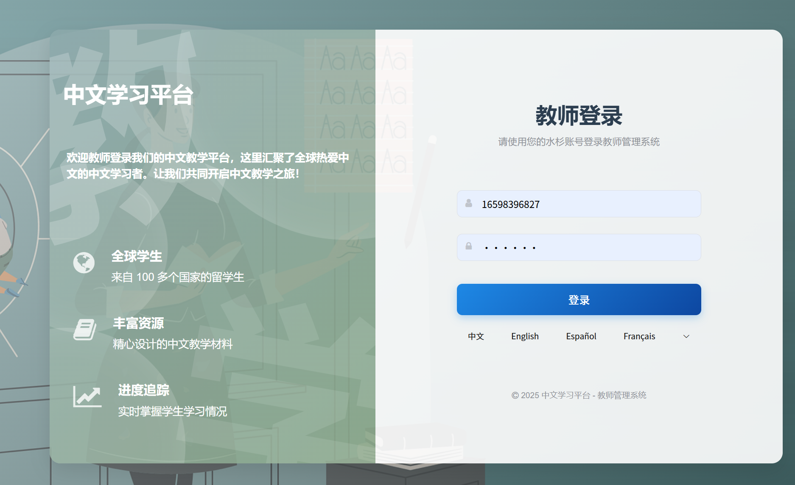
  

<b>💻 Web Platform</b>

## 🎬 Product Video

## 🌿 Project Logo

  
    
  

